### CH1-项目管理概述

#### 项目管理好处

- Better control of financial, physical, and human resources
- Improved customer relations
- Shorter development times
- Lower costs
- Higher quality and increased reliability
- Higher profit margins
- Improved productivity
- Better internal coordination
- Higher worker morale

#### 项目的定义 ★

为创造一个特定的产品、服务或者成果而采取的临时性努力

#### 项目属性 ★

- 有特定目的
- 临时性
- 不断完善细节而逐步开展
- 需要不同领域资源
- 有主要客户或发起人
- 有不确定性

#### 项目约束 ★

范围、时间、成本

#### 项目管理的定义 ★

在项目活动中运用专门的知识、技能、工具和技术，以满足项目需求。

#### 项目管理知识领域 ★

##### 四个核心

​	范围-Scope	成本-Cost	时间-Time	质量-Quality

##### 四个辅助 

​	人力-HumanResource	采购-Procuremen	沟通-Communications	风险-Risk

##### 集成管理-Integration

##### 干系人管理-Stakeholders

#### 成功项目管理

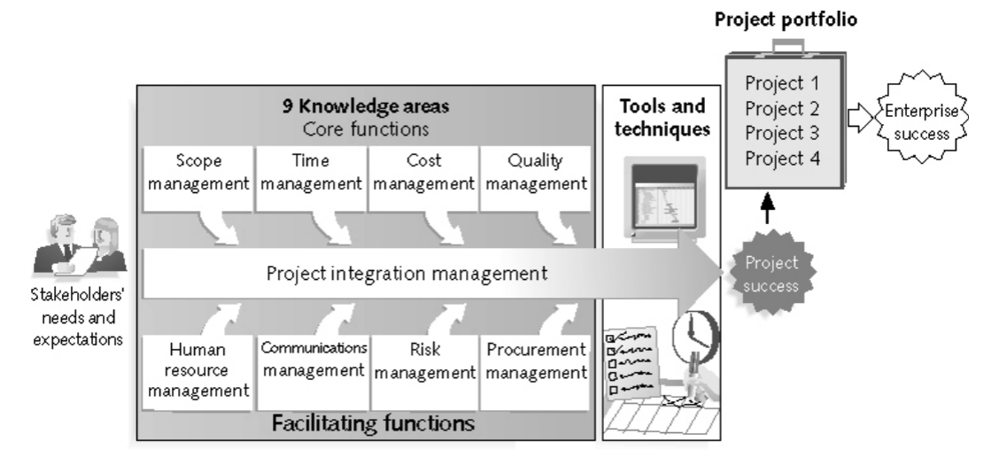

#### 项目干系人的定义 ★

Stakeholders

参与项目获受项目活动影响的人

项目发起人、项目团队、支持人员、客户、使用者、供应商、甚至是项目的反对者

#### 项目管理人人员所需技能

1. 项目管理知识体系
2. 应用领域知识、标准和法规
3. 项目环境知识
4. 一般管理知识和技能
5. 软技能或人际关系技能

#### 相关术语 ★

**PMI-项目管理协会**

美国的国际性项目管理专业协会

**PMO-项目管理办公室**

企业中的有组织的团队

**PMP-项目管理师**

PMI提供的认证

### CH2-项目管理和IT背景

简单了解

#### 三球模型

业务、组织、技术

#### 可交付成果 ★

是一个产品或者服务

#### 项目生命周期

记得区分**项目管理过程组（CH3）**

概念 -> 开发 -> 实施 -> 收尾

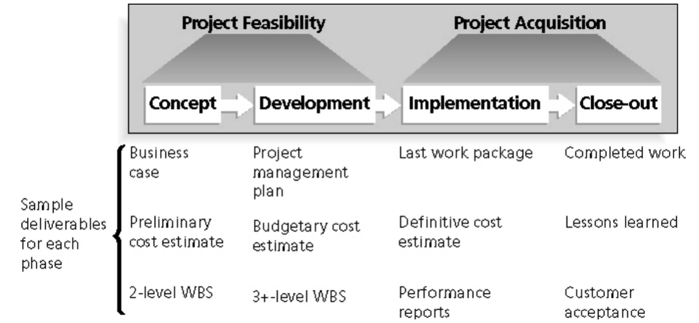

#### 产品生命周期

**SDLC - Systems Development Life Cycle**

描述开发信息系统的不同阶段的框架

瀑布式、螺旋式、渐增式、RAD（快速应用开发）

**ASD - 自适应软件开发**

**敏捷软件开发**

#### 产品开发的组织结构

- 职能型 - 按职位
- 项目型 - 按项目
- 矩阵型 - 按职能下划分职位

#### Scrum图相关

Product backlog（产品订单）、Sprint backlog（冲刺订单）、Potentially shippable product increment（潜在可交付产品增量）、（Burndown Chart 燃尽图）

#### 项目激励的方法

马斯洛激励理论

需求层次理论：生理需求 安全需求 归属需求 尊重需求 自我实现(塔顶)

### CH3-案例研究

#### 过程Program ★

针对某一特定结果的的一系列行动

#### 项目管理过程组 ★

五阶段

- 启动阶段 - initiating
- 计划阶段 - planning
- 执行阶段 - executing
- 监控阶段 - monitoring and controlling
- 收尾阶段 - closing

**执行阶段花费时间最多**

### CH4-项目综合管理

章程 计划

#### 项目综合管理主要流程

1. 制定项目章程
2. 开发项目管理计划
3. 指挥并管理项目执行
4. 监控项目工作
5. **综合变更控制**
6. 项目或阶段收尾

#### NPV-净现值分析 ★ 🧮

计算预期净货币收益或损失的方法

会计算NPV ROI（投资回报率）

NPV = 每年净收入（现金流） * 当年折现因子 的总和

折现因子 = 1 / (1 + 折现率) ^ 当年年份

ROI = （折现收益总额 - 折现成本总额）/ 折现成本

#### 项目中的变更控制

主要的**项目工具**：

变更管理系统、配置管理系统、项目管理信息系统、工作授权系统

变更控制系统**CCS**

变更控制委员会**CCB**

**配置管理** ★（Configuration management）是综合变更控制的一个重要部分（结合**质量管理**）

​	确保关于项目产品的描述是正确且完整的

### CH5-项目范围管理

#### 范围	Scope

开发项目产品所涉及的所有工作和用来开展工作的所有过程

#### 项目范围管理

1. 制定范围管理计划

2. 收集需求

3. 定义范围

4. 创建工作分解结构WBS

5. 验证范围

   ​	指可交付成果的正式接受

6. 控制范围

#### Scope baseline

The approved project scope statement and its associated WBS and WBS dictionary.

#### WBS

**制定方法**

- 使用指南
- 类比法
- 自上而下
- 自下而上
- 思维导图

**WBS字典**

WBS内容简短，配合描述WBS的详细信息

**工作包**

WBS的最低层次

### CH6-项目进度管理 ★

有7个主要的过程

- 计划进度管理
- 定义活动
- 排序活动

- 估算活动资源
- 估算活动工期
- 制订进度计划
- 控制进度

#### **活动清单**

包含在项目进度中的活动列表

#### **活动属性**

与进度相关的更多信息，例如前导活动、后继活动、逻辑关系、提前、滞后、资源需求、约束、强制日期、相关假设。**与WBS和WBS字典保持一致**。

#### **里程碑 ★**

一个**没有工期**的重要事件

**SMART准则**

- Specific 明确的
- Measurable 可度量的
- Assignable 可分配的
- Realistic 现实的
- Time-framed 有时间限制的

#### **三种依赖**

强制依赖、自由依赖、外部依赖

工作中的内在关系、项目定义的活动之间关系、非项目活动和项目之间的关系

#### **网络图**

使用**双代号网络图AOA**或**箭线图法ADM**

箭头表示活动顺序前后，数字表示任务需要天数

​			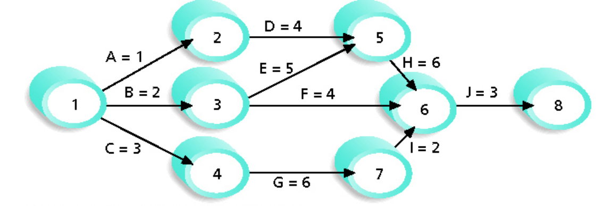

#### **前导图法PDM** ★

优点：

- 多数管理软件使用PDM

- 避免虚活动的使用

  虚活动：没有工期且没有资源

- 表示了不同依赖，AOA只有完成-开始依赖

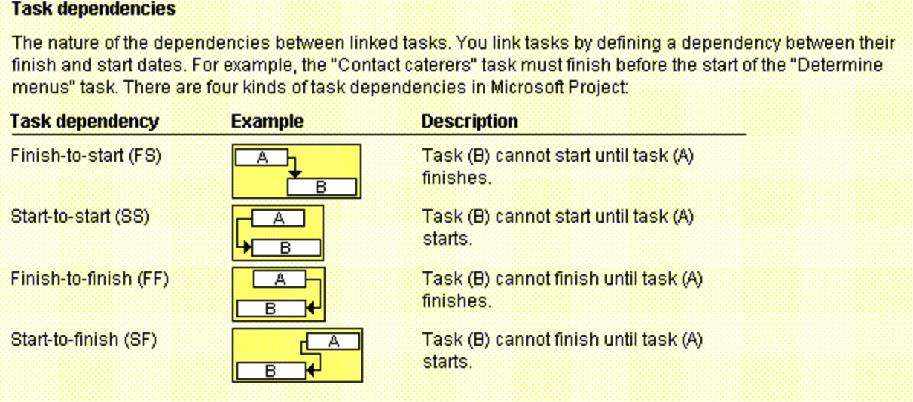

​		

#### 甘特图的符号

黑色线——概要任务（无需估算工期）

黑色菱形——里程碑

箭头线——依赖关系

长方形——汇总任务

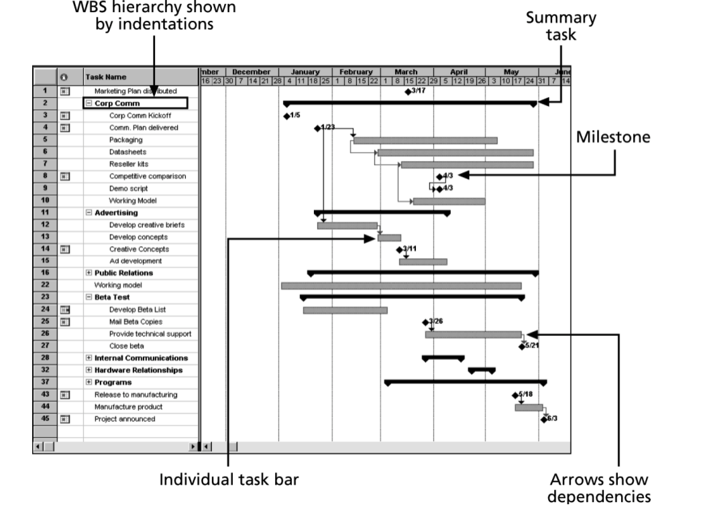

#### 资源估算

**参数估计法**

**三点估计法**

乐观，悲观，最可能的估算

#### 关键路径 ★

决定了项目**最早完成时间**的一系列活动，是项目的最长路径，拥有**最少**的时差或浮动时间

**时差或浮动时间**

在不延误后继活动或者项目完成时间的情况下，任务可以推后的时间

#### 关键路径法CPM ★ 🧮

把每个通过网络图的路径上将工期累加起来。最长路径是关键路径。

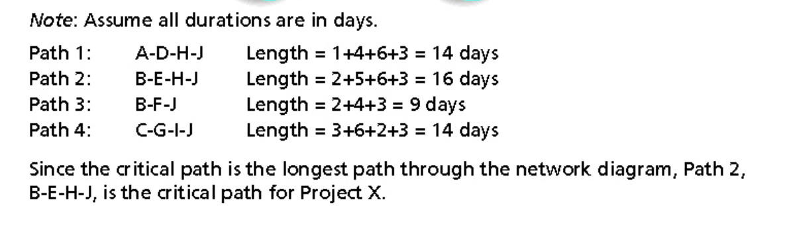

#### ES、EF、LS、LF ★ 🧮

先算关键路径，没有浮动

正推法计算ES、EF

倒推法计算LS、LF

**总时差**

**LS - ES** 或 **LF - EF**

**自由时差**

min{ES1-EF0,ES2-EF0,...},1号活动和2号活动都在0号活动之后

#### 计划评审技术PERT ★ 🧮

PERT加权平均 = ( 乐观时间 + 4 * 最可能的时间 + 悲观时间 ) / 6

### CH7-项目成本管理

计算题考得多

四个过程

1. 计划成本管理
2. 成本估算
3. 确定估算
4. 成本控制

#### Cost baseline

A time-phased budget that project managers use to measure and monitor cost performance.

#### 成本类型

直接成本、间接成本、沉没成本

#### 成本估算类型

粗粒度估算ROM

预算估算

确定性估算

#### 挣值管理EVM ★ 🧮

earned value management

|     术语     |            英文缩写             |               定义               |        公式        |
| :----------: | :-----------------------------: | :------------------------------: | :----------------: |
|    计划值    |        planned value PV         |     预算，已批准的总成本估算     |       初始值       |
|   实际成本   |         actual cost AC          | 完成一项获得的直接和间接成本总和 |       初始值       |
|  完成百分比  |     rate of performance RP      |        完成计划工作的比率        |       初始值       |
|     挣值     |         earned value EV         |       实际完成工作的估算值       |      PV * RP       |
|   成本偏差   |        cost variance CV         |    正偏差反映所用成本低于计划    |      EV - AC       |
|   进度偏差   |      schedule variance SV       |  正偏差意味执行工期比计划时间短  |      EV - PV       |
| 成本绩效指数 |   cost performance index CPI    |      大于1说明在预算范围内       |      EV / AC       |
| 进度绩效指数 | schedule performance index  SPI |       大于1说明超前于计划        |      EV / PV       |
|   完工预算   |    budget at  completion BAC    |           原始的总预算           |       初始值       |
|   完工估算   |   estimate at completion EAC    |          估计的所需成本          |     BAC / CPI      |
| 完工时间估计 |                -                |          估计的所需时间          | 原始时间估算 / SPI |

### CH8-项目质量管理

有资料说没有考很多

1. 计划质量管理
2. 实施质量保证SQA
3. 控制质量

#### 鱼骨图

因果图、石川图、鱼骨图

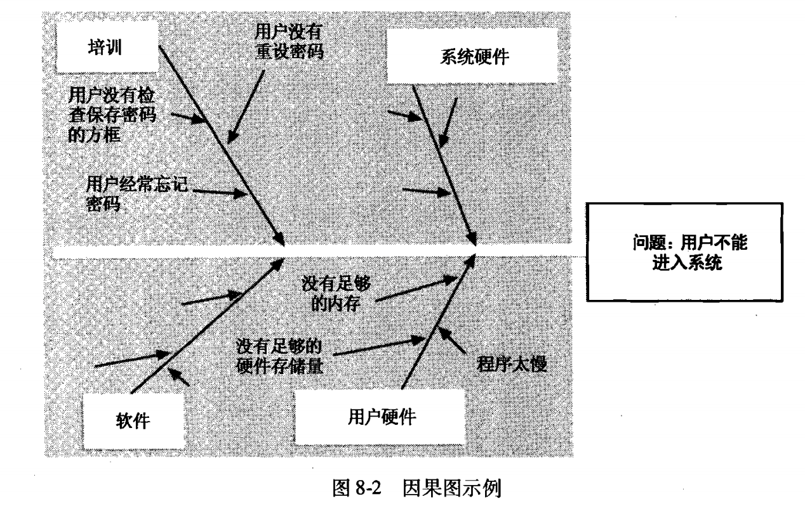

#### 控制图

七点运行法则：连续七个数字都在均值以下或以上，或都呈上升或下降，需要检查是否有非随机问题

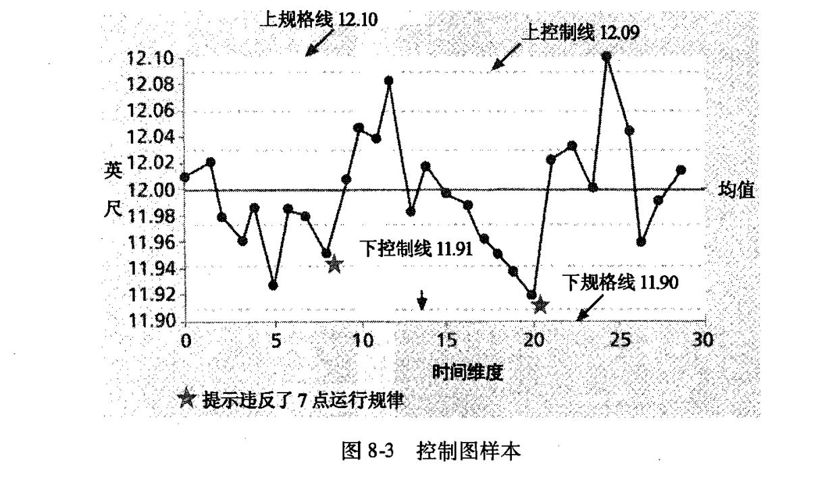

#### PATRTO图

二八图：影响质量的最重要因素，大部分的问题都是由20%的问题引起的

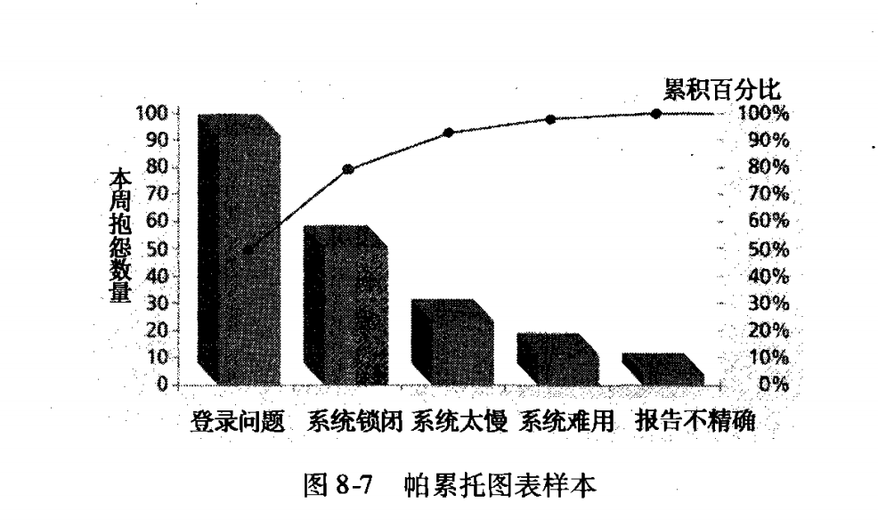

#### 6-sigma ★

一种灵活的综合性系统方法，通过它实现、维持、最大化商业的成功。

应用6-sigma进行质量控制的项目通常遵循称为**DMAIC**的五阶段改进流程

1. 界定
2. 度量
3. 分析
4. 改进
5. 控制

#### ISO9000

ISO是国际的标准化机构组成的网络组织

ISO9000是由ISO发展来的质量系统标准

#### 能力熟成度模型集成CMMI

capability maturity model integration

为一个组织的各种过程提供的有关有效过程基本要素的一种过程改进方法

CMMI的等级

- 不完整级
- 执行级
- 管理级
- 定义级
- 量化管理级
- 优化级

### CH9-人力资源管理

1. 计划人力资源管理
2. 组建项目团队
3. 建设项目团队
4. 管理项目团队

#### 马斯洛激励理论 ★

需求层次理论：生理需求 安全需求 归属需求 尊重需求 自我实现(塔顶)

#### 人力资源的组织架构

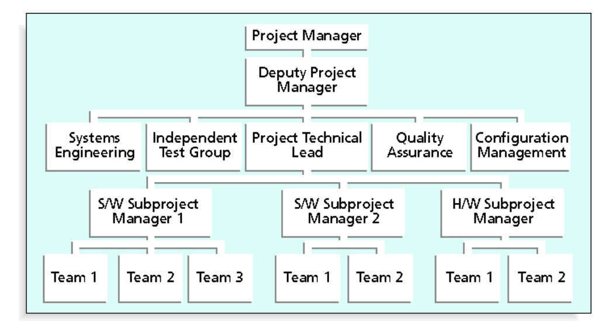

#### 责任分配矩阵RAM

将WBS中的项目工作和OBS中的负责实施的阮元相匹配的矩阵

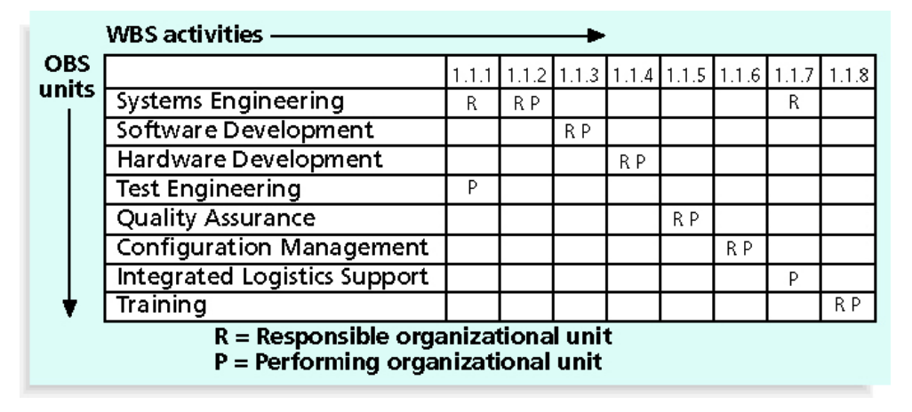

#### 产品开发的组织结构

- 职能型 - 按职位
- 项目型 - 按项目
- 矩阵型 - 按职能下划分职位

#### Tuckman Model

Forming、Storming、Norming、Performing、Adjourning (FSNPA)

形成、震荡、规范、执行、终止

### CH10-项目沟通管理

据说：实际中重要 ，考试不会涉及太多

1. 确定干系人信息和沟通需求
2. 管理沟通
3. 控制沟通

#### 沟通渠道数 🧮

沟通渠道数 = n ( n - 1) / 2

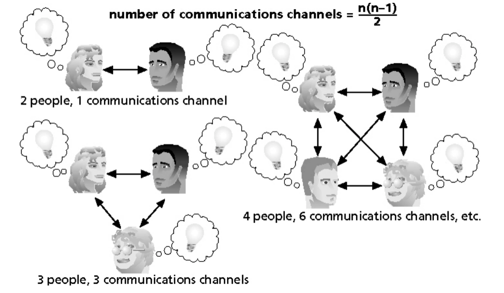

#### 冲突解决方法

了解？那就是瞎掰

- 更好的沟通技能
- 有效的会议
- 有效使用电子邮件、即时信息、文本和协作工具
- 项目沟通模板

### CH11-项目风险管理

能够识别项目开发过程中的风险

1. 计划风险管理
2. 识别风险
3. 实施定性风险分析
4. 实施定量风险分析
5. 计划风险响应
6. 控制风险

#### 风险效用

**Risk utility**

是指从潜在回报中得到的满意度

 **Risk tolerance**

是指在项目或业务目标的潜在影响中实体能接受的最大偏差

#### 风险响应策略

应急计划、退路计划、应急储备金或应急津贴

#### 预期货币值EMV ★ 🧮

expected monetary value

是风险事件概率和风险事件货币值的乘积

越大越好

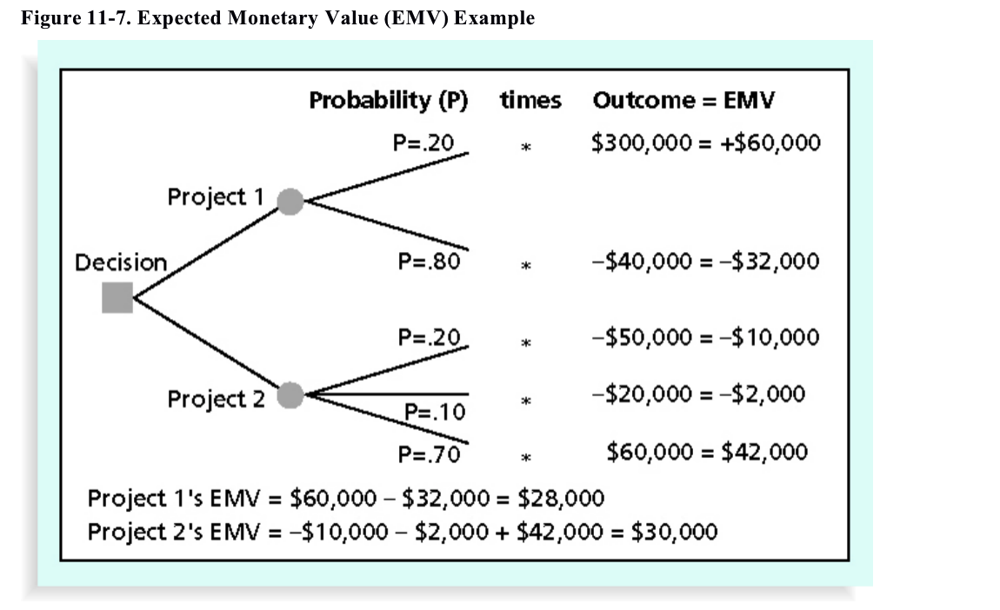

### CH12-项目采购管理

#### 合同类型

##### 固定价格合同 或 总付合同

- 严格固定价格FFP
- 有奖励的固定价格FPIF
- 经济价格调整的固定价格合同FP-EPA

##### 成本补偿合同

- 成本加激励合同CPIF
- 成本加固定费合同CPFF
- 成本加奖励费合同CPAF
- 成本加百分比合同CPPC

**时间与材料合同**

**单位定价**

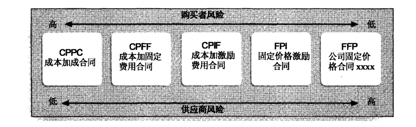

#### 计算购买还是租赁 🧮

根据使用日期简单计算

#### 采购说明书SOW

采购所需工作的描述

#### RFQ & RFP

为买方明确规定的标准项目提供定价

当有不同的方法来满足买方的需要时，建议书是卖方准备的文件